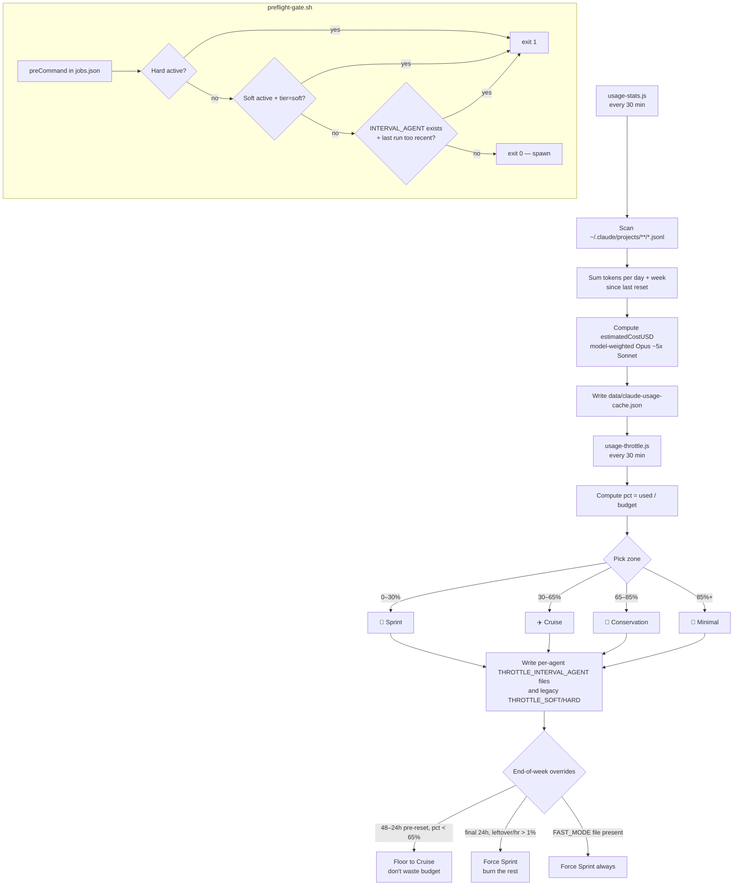

# agent-usage-throttle — Graduated Token Budget Throttle for Claude Code Pipelines

Auto-paces your Claude Code agent pipeline against a weekly token budget. Four graduated zones (Sprint / Cruise / Conservation / Minimal) progressively slow agents as you approach the limit, with end-of-week burn / floor logic so you don't waste headroom or hit a cliff. Uses model-weighted estimated cost (Opus ≈ 5× Sonnet) so the numbers actually track what Anthropic measures.

> Part of [The Agent Crafting Table](https://github.com/Agent-Crafting-Table) — standalone Claude Code agent components.

## How It Works



## Four Zones

| Zone | Range | Behavior |
|---|---|---|
| 🚀 **Sprint** | 0–30% | Full speed. No per-agent throttle. |
| ✈️ **Cruise** | 30–65% | Developer / Reviewer 25 min, TRD Watcher / Merge Watcher 15 min, CI fixers 5 min, PM 30 min, others normal. |
| 🐢 **Conservation** | 65–85% | Developer 45 min, Reviewer 60 min, CI fixers 15–30 min, PM 2h, others 6h. Also writes legacy `THROTTLE_SOFT`. |
| 🔴 **Minimal** | 85%+ | Most agents 3h, PM / PdM / Auditor 6h+. Also writes legacy `THROTTLE_HARD`. |

Boundaries have a 2-percentage-point hysteresis on the way down to prevent flapping.

## End-of-Week Logic

Weekly budgets reset on a known schedule (Anthropic Max default: Thursday 2:00 AM UTC, configurable via `USAGE_RESET_DAY` / `USAGE_RESET_HOUR`). The throttle reads `nextResetAt` from the cache and applies two overrides near the boundary:

- **48–24h pre-reset, if pct < 65%** → floor to Cruise. Stops you from under-spending budget you've already paid for.
- **Final 24h, if `leftover% / hours-left > 1%/h`** → force Sprint. Burns the remaining budget on real work instead of leaving it on the floor at the rollover.

## FAST_MODE Override

`touch $THROTTLE_RUNTIME_DIR/FAST_MODE` to force Sprint zone regardless of usage and end-of-week state. Useful when you want to push through a refactor or unblock a stalled review session. Delete the file to restore normal zone selection.

## Drop-in

```bash
cp scripts/usage-stats.js    /your/workspace/scripts/
cp scripts/usage-throttle.js /your/workspace/scripts/
cp scripts/preflight-gate.sh /your/workspace/scripts/
chmod +x /your/workspace/scripts/preflight-gate.sh
```

Add to your `crons/jobs.json` (see `examples/jobs.json` for full entries):

```json
{ "id": "usage-stats",    "schedule": "*/30 * * * *", "runner": "shell",
  "shellCommand": "node /workspace/scripts/usage-stats.js" },
{ "id": "usage-throttle", "schedule": "5,35 * * * *", "runner": "shell",
  "shellCommand": "node /workspace/scripts/usage-throttle.js" }
```

For each agent job, add a `preCommand` that gates spawns. Pass `--agent <name>` to enable graduated zone throttling (Cruise+); without it, only the legacy soft/hard pause behavior applies.

```json
"preCommand": "/workspace/scripts/preflight-gate.sh --tier soft --agent developer --log /workspace/agent-log.md"
```

## Back-Compat with the 2-Tier API

This release supersedes the original two-tier soft/hard throttle but keeps full back-compat. Whenever the zone is **Conservation or higher**, `THROTTLE_SOFT` is written. Whenever the zone is **Minimal**, `THROTTLE_HARD` is written. Existing preflight gates that only check those two files keep working unchanged. The new graduated behavior only kicks in when you pass `--agent` to the gate.

## Why

Autonomous agent pipelines burn tokens fast — especially when multiple agents run in parallel and Opus handles the heavy lifting. A binary on/off throttle either pauses too late (everything stops mid-task at 90%) or too early (the whole pipeline freezes at 70% with the rest of the budget unused). A 4-zone graduated approach:

1. Slows agents progressively as you approach the cap rather than cliff-pausing.
2. Doesn't waste end-of-week headroom — the EOW floor keeps you in Cruise even on slack weeks.
3. Burns leftover budget at the end of the cycle if there's enough headroom, instead of letting it expire at reset.
4. Gives a manual escape hatch (`FAST_MODE`) for "just push through this" sessions.

Anthropic measures usage as a model-weighted composite (Opus costs ~5× Sonnet), so naive output-token counting will read 25% while the real number is 68%. `usage-stats.js` does the model weighting for you.

## Configuration

All settings via environment variables or `.env` file in `WORKSPACE_DIR`:

**Throttle (`usage-throttle.js`)**

| Variable | Default | Description |
|---|---|---|
| `WEEKLY_USD_BUDGET` | `1700` | Budget ceiling in estimated USD cost units |
| `THROTTLE_RUNTIME_DIR` | `data/runtime` | Where ZONE / THROTTLE_INTERVAL_* / THROTTLE_SOFT / THROTTLE_HARD / FAST_MODE live |
| `USAGE_CACHE_FILE` | `data/claude-usage-cache.json` | Cache generated by usage-stats.js |
| `THROTTLE_AGENT_NAMES` | (developer, reviewer, trd_watcher, merge_watcher, pr_ci_fixer, main_ci_fixer, project_manager, product_manager, codebase_auditor) | Comma-separated agent names for which to write `THROTTLE_INTERVAL_<AGENT>` files |
| `DISCORD_POST_SCRIPT` | — | `node <path> <channel_id> <message>` helper for zone-transition alerts |
| `DISCORD_CHANNEL_ID` | — | Channel to post zone-transition alerts |

**Preflight gate (`preflight-gate.sh`)**

| Flag / Env | Default | Description |
|---|---|---|
| `--tier soft\|hard` | `soft` | Block on legacy SOFT/HARD files. `soft` blocks at Conservation+, `hard` only at Minimal. |
| `--agent <name>` | — | Snake_case agent name. Enables zone-throttle skip via `THROTTLE_INTERVAL_<AGENT>`. |
| `--log <path>` | `$WORKSPACE_DIR/agent-log.md` | Path to a log file with ISO-8601 timestamps + agent names; used to compute "minutes since last run". |

**Reset schedule + scanning (`usage-stats.js`)**

| Variable | Default | Description |
|---|---|---|
| `CLAUDE_PROJECTS_DIR` | `~/.claude/projects/-workspace` | Where JSONL session files live |
| `USAGE_RESET_DAY` | `4` | Day of week for reset: 0=Sun 1=Mon … 4=Thu 6=Sat. Set `-1` for monthly |
| `USAGE_RESET_HOUR` | `2` | UTC hour of the reset (e.g. `2` = 2:00 AM UTC) |
| `USAGE_RESET_DOM` | `1` | Day of month for monthly reset (only used when `USAGE_RESET_DAY=-1`) |

### Plan presets

```bash
# Anthropic Max (20×) — Thu 2am UTC reset (default, no config needed)

# Anthropic Pro — typically Mon midnight UTC
USAGE_RESET_DAY=1
USAGE_RESET_HOUR=0
WEEKLY_USD_BUDGET=400   # recalibrate for your plan

# API / pay-per-token — monthly reset on the 1st
USAGE_RESET_DAY=-1
USAGE_RESET_DOM=1
USAGE_RESET_HOUR=0
WEEKLY_USD_BUDGET=200   # set to your actual monthly spend target
```

### Calibrating `WEEKLY_USD_BUDGET`

The default `1700` was calibrated for Max (20×): at $1,160 estimated cost, claude.ai showed 68% used, implying ~$1,706 total.

To calibrate for any plan:
1. Note the % shown on claude.ai → Settings → Usage
2. Run `node scripts/usage-stats.js` and read `weekTotal.estimatedCostUSD`
3. `WEEKLY_USD_BUDGET = estimatedCostUSD / (claude_pct / 100)`

## Example Output

```
# usage-throttle.js (every 30 min)
[usage-throttle] $1145 / $1700 (67.4%) zone=conservation hrs_to_reset=42.3
[usage-throttle] $1623 / $1700 (95.5%) zone=minimal hrs_to_reset=12.5
[usage-throttle] $1480 / $1700 (87.1%) zone=sprint mode=eow-burn hrs_to_reset=8.0
[usage-throttle] $480 / $1700 (28.2%) zone=cruise mode=eow-floor hrs_to_reset=36.0

# Audit trail at runtime/throttle-history.jsonl
{"ts":"2026-05-01T07:35:00Z","zone":"cruise","pct":42.3,"mode":null}
{"ts":"2026-05-01T08:05:00Z","zone":"conservation","pct":67.4,"mode":null}

# preflight-gate.sh (from cron-runner logs)
[cron] developer  preCommand exited 1 — skipping tick (interval 25min, ran 12min ago)
[cron] reviewer   preCommand exited 0 — spawning agent
```

## Requirements

- Node.js 16+
- Claude Code CLI installed and authenticated
- [cron-framework](https://github.com/Agent-Crafting-Table/cron-framework) for `preCommand` support (or any scheduler that supports a pre-flight hook)
- Zero additional npm dependencies
