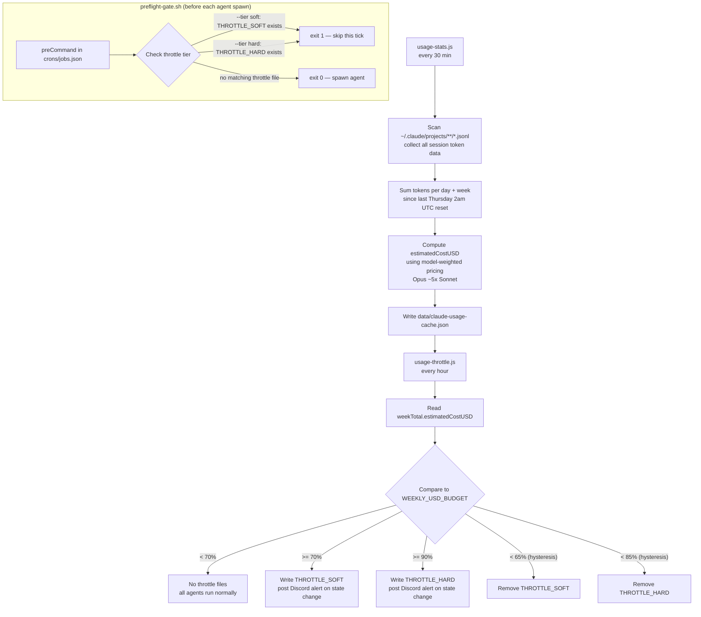
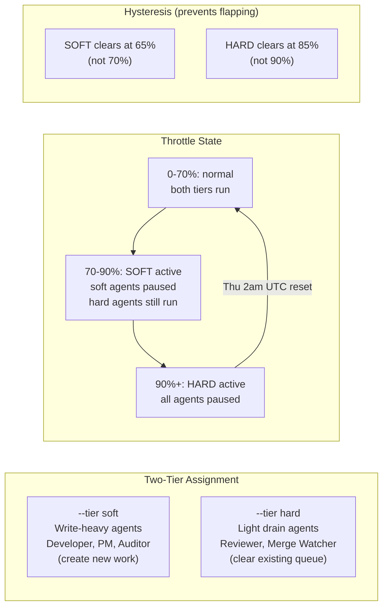

# agent-usage-throttle — Two-Tier Token Budget Throttle for Claude Code Pipelines

Automatically pauses your Claude Code agent pipeline when weekly token usage gets high — soft pause for write-heavy agents at 70%, hard block for everything at 90%. Uses model-weighted estimated cost (Opus ≈ 5× Sonnet) as the metric so the numbers actually track what Anthropic measures.

> Part of [The Agent Crafting Table](https://github.com/Agent-Crafting-Table) — standalone Claude Code agent components.

## How It Works





## Drop-in

```bash
cp scripts/usage-stats.js    /your/workspace/scripts/
cp scripts/usage-throttle.js /your/workspace/scripts/
cp scripts/preflight-gate.sh /your/workspace/scripts/
chmod +x /your/workspace/scripts/preflight-gate.sh
```

Add to your `crons/jobs.json` (see `examples/jobs.json` for full entries):

```json
{ "id": "usage-stats",    "schedule": "*/30 * * * *", "runner": "shell",
  "shellCommand": "node /workspace/scripts/usage-stats.js" },
{ "id": "usage-throttle", "schedule": "5 * * * *",    "runner": "shell",
  "shellCommand": "node /workspace/scripts/usage-throttle.js" }
```

Add `preCommand` to any agent job you want gated:

```json
"preCommand": "/workspace/scripts/preflight-gate.sh --tier soft"
```

## Why

Autonomous agent pipelines burn tokens fast — especially when multiple agents run in parallel and Opus handles the heavy lifting. Without a budget gate:

- The pipeline runs at full speed until the weekly limit hits, then **everything stops cold** mid-task
- You have no visibility into how close you are until it's too late
- Anthropic measures usage as a model-weighted composite (Opus costs ~5× Sonnet), so naive output-token counting will read 25% while the real number is 68%

This system gives you a graceful two-tier ramp-down:

1. **Soft (70%)** — pause write-heavy agents (Developer, PM, Auditor). Reviewers and merge watchers keep draining the existing queue
2. **Hard (90%)** — pause everything. Pipeline resumes automatically after the weekly reset (Thursday 2:00 AM UTC on Max plans)

## Two Tiers in Practice

| Tier | Threshold | Clears at | Blocks |
|------|-----------|-----------|--------|
| Soft | 70% | 65% | Agents you mark `--tier soft` in preCommand |
| Hard | 90% | 85% | All agents (hard also implies soft) |

**Hysteresis** (the 5% gap between set and clear) prevents flapping when usage sits right at the boundary.

Assign tiers by agent role:
- `--tier soft` — write-heavy agents that create new work (Developer, PM, Auditor)
- `--tier hard` — light agents that drain existing work (Reviewer, Merge Watcher)

## Configuration

All settings via environment variables or `.env` file in `WORKSPACE_DIR`:

**Throttle thresholds (`usage-throttle.js`)**

| Variable | Default | Description |
|---|---|---|
| `WEEKLY_USD_BUDGET` | `1700` | Budget ceiling in estimated USD cost units |
| `THROTTLE_SOFT_PCT` | `70` | Soft pause threshold (%) |
| `THROTTLE_HARD_PCT` | `90` | Hard pause threshold (%) |
| `THROTTLE_RUNTIME_DIR` | `data/runtime` | Where THROTTLE_SOFT / THROTTLE_HARD files live |
| `USAGE_CACHE_FILE` | `data/claude-usage-cache.json` | Cache generated by usage-stats.js |
| `DISCORD_POST_SCRIPT` | — | `node <path> <channel_id> <message>` helper for alerts |
| `DISCORD_CHANNEL_ID` | — | Channel to post soft/hard transition alerts |

**Reset schedule + scanning (`usage-stats.js`)**

| Variable | Default | Description |
|---|---|---|
| `CLAUDE_PROJECTS_DIR` | `~/.claude/projects/-workspace` | Where JSONL session files live |
| `USAGE_RESET_DAY` | `4` | Day of week for reset: 0=Sun 1=Mon … 4=Thu 6=Sat. Set `-1` for monthly |
| `USAGE_RESET_HOUR` | `2` | UTC hour of the reset (e.g. `2` = 2:00 AM UTC) |
| `USAGE_RESET_DOM` | `1` | Day of month for monthly reset (only used when `USAGE_RESET_DAY=-1`) |

### Plan presets

```bash
# Anthropic Max (20×) — Thu 2am UTC reset (default, no config needed)

# Anthropic Pro — typically Mon midnight UTC
USAGE_RESET_DAY=1
USAGE_RESET_HOUR=0
WEEKLY_USD_BUDGET=400   # recalibrate for your plan

# API / pay-per-token — monthly reset on the 1st
USAGE_RESET_DAY=-1
USAGE_RESET_DOM=1
USAGE_RESET_HOUR=0
WEEKLY_USD_BUDGET=200   # set to your actual monthly spend target
```

### Calibrating `WEEKLY_USD_BUDGET`

The default `1700` was calibrated for Max (20×): at $1,160 estimated cost, claude.ai showed 68% used, implying ~$1,706 total.

To calibrate for any plan:
1. Note the % shown on claude.ai → Settings → Usage
2. Run `node scripts/usage-stats.js` and read `weekTotal.estimatedCostUSD`
3. `WEEKLY_USD_BUDGET = estimatedCostUSD / (claude_pct / 100)`

## Example Output

```
# usage-stats.js
Scanning 312 JSONL files from last 14 days...
Written: data/claude-usage-cache.json
Week total: $1563 est. cost, 20.6M output tokens

# usage-throttle.js
[usage-throttle] $1563 / $1700 est. weekly cost (91.9%) — soft=true hard=true

# preflight-gate.sh (from cron-runner logs)
[cron] gl-developer preCommand exited 1 — skipping tick
[cron] gl-reviewer  preCommand exited 0 — spawning agent
```

## Requirements

- Node.js 16+
- Claude Code CLI installed and authenticated
- [cron-framework](https://github.com/Agent-Crafting-Table/cron-framework) for `preCommand` support (or any scheduler that supports a pre-flight hook)
- Zero additional npm dependencies
